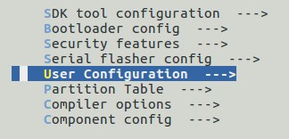

# Spiffs config

> make menuconfig

## User Configuration



## Config SPIFFS:

### Format if Mount failed
    if the spiffs image in flash is mount failed ,
    then this demo will format the  spiffs flash partition in the init stage.

### Test spiffs
    Do a sample test, open,write,rename,stat,close


# Spiffs Image

## Create spiffs image
> ./mkspiffs -u ./spiffs -b 4096 -p 256 -s 0x100000 spiffs.bin

```
-c : create spiffs image from a directory   
-b : fs block size, in bytes    
-p : fs page size, in bytes     
-s : fs image size, in bytes
```

## Unpack spiffs image
> ./mkspiffs -u ./spiffs -b 4096 -p 256 -s 0x100000 spiffs.bin

## Flash spiffs image
> python $IDF_PATH/components/esptool_py/esptool/esptool.py --chip esp32 --port /dev/ttyUSB0 --baud 1152000 write_flash -z 0x110000 spiffs.bin

## Read spiffs image
> python $IDF_PATH/components/esptool_py/esptool/esptool.py --chip esp32 --port /dev/ttyUSB0 --baud 1152000 read_flash 0x110000 0x100000 spiffs.bin
